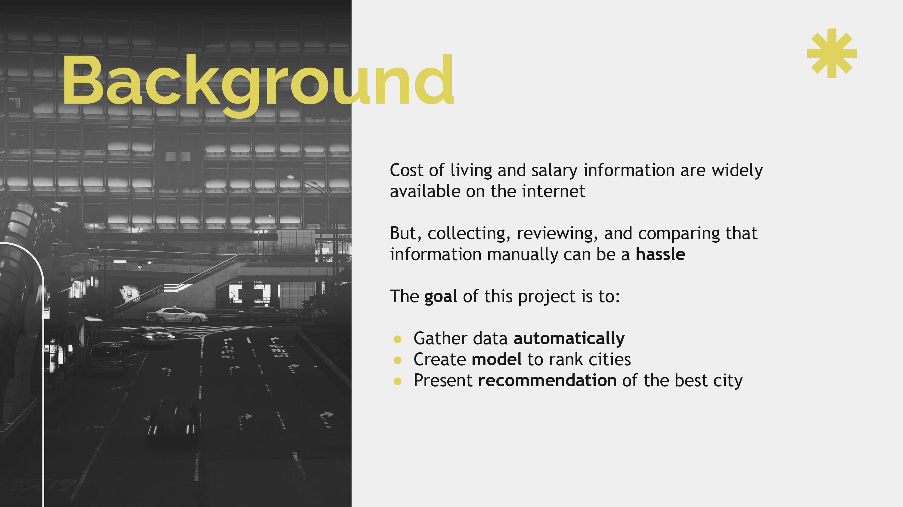
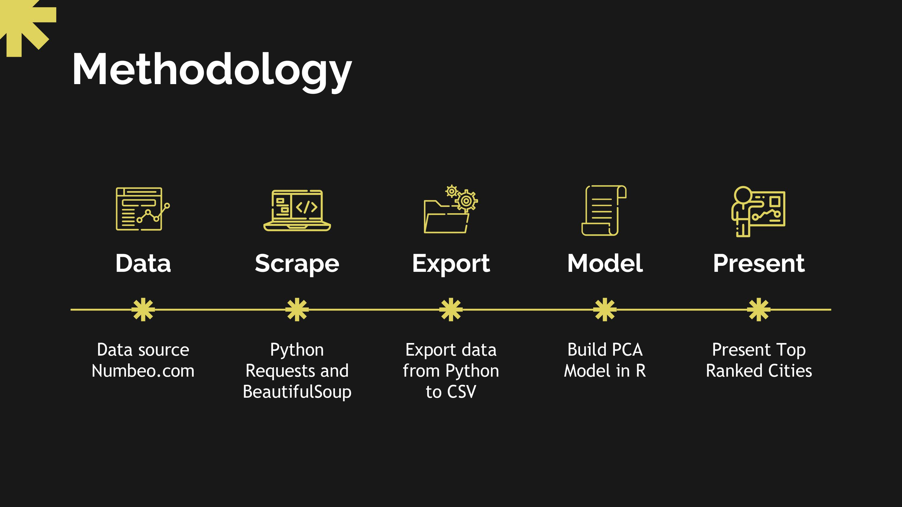
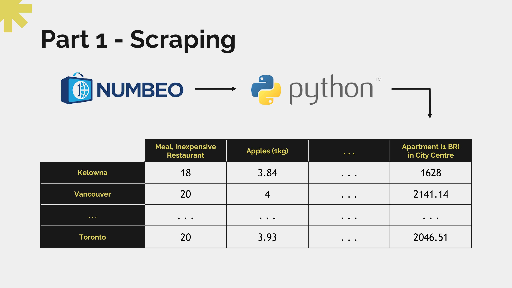
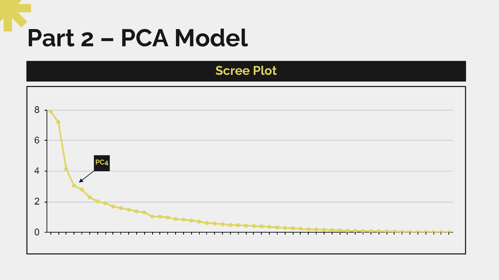
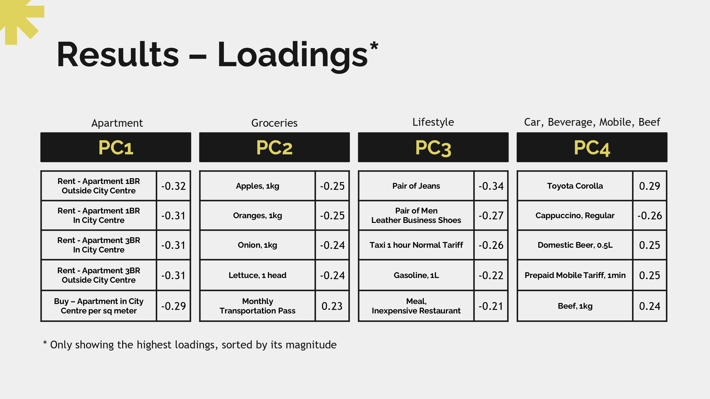
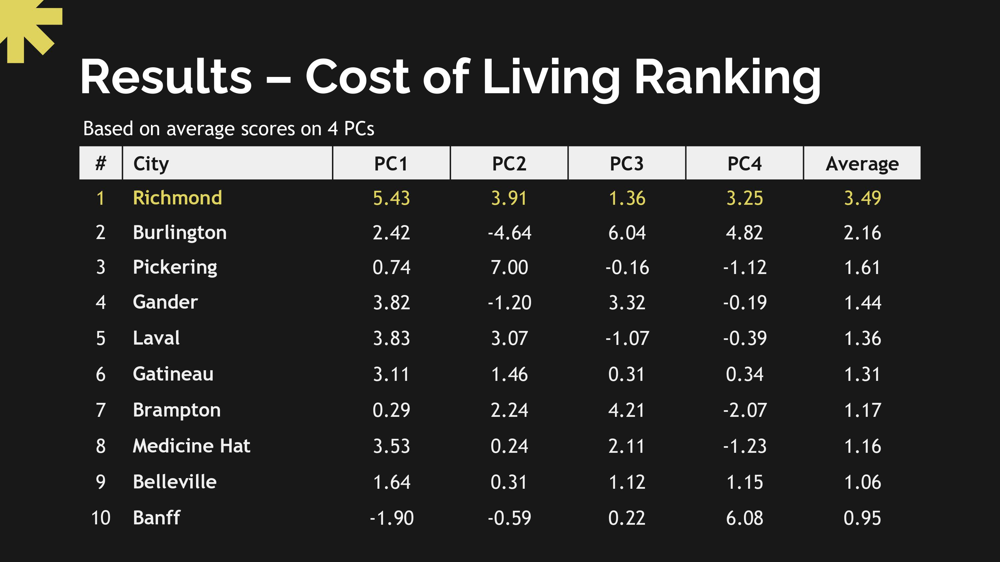
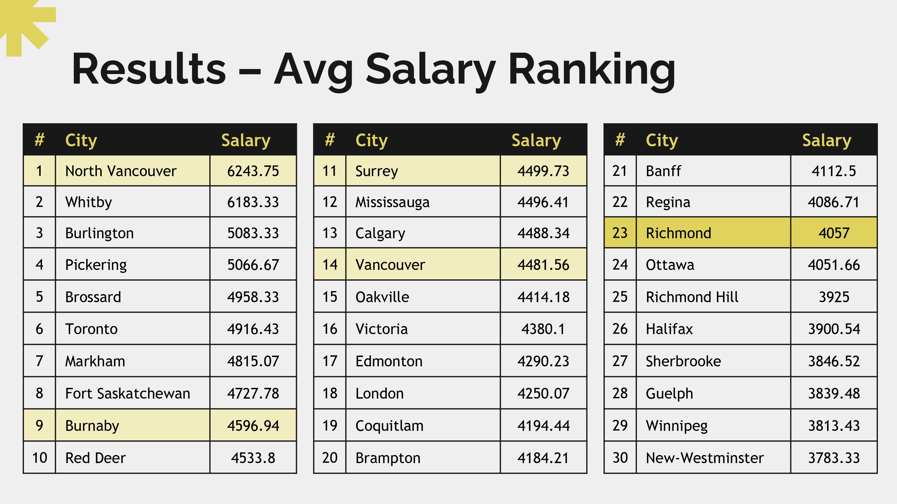

# The Best Canadian City To Live In, Financially

## Introduction

Getting a job and figuring out where to live is one of the major routes for most university graduates. For international students studying in Canada, who usually do not have a permanent home, choosing their next home may be challenging as they may be unfamiliar with the country. In choosing where to live, two essential things to consider are the cost of living and salary information of that location. Thus, to help international students in deciding where to live in Canada, I scraped cost of living and salary information across cities in Canada and built a scoring system to rank which city is the best to live in financially.

## Background

There is an abundance of information available on the internet regarding the cost of living and salary information of cities in Canada. Despite the availability of information, collecting, reviewing, and comparing that information can be challenging and time-consuming. This project aims to gather that information automatically, analyze it, and present rankings of cities based on their scores on cost of living and salary. According to this ranking information, the decision maker can then choose the best city in Canada to live in based on its financial feasibility.

## Methodology

In order to gather cost of living and salary information across cities in Canada, data was scraped from numbeo.com, which is one of the world's largest cost of living database. This part was done in Python using the ‘requests’ library to request data from a specified URL, and the ‘BeautifulSoup’ library which is used to parse the HTML response. The result is then stored in a data frame (with cities along the rows and cost of food, apartment, salary, etc. along the columns) and later converted to a csv for further analysis in R. In R, Principal Component Analysis (PCA) was used to come up with a scoring system for the cities. PCA works by transforming the original variables (there are 53 variables in the original data) into a set of new variables where most of the variation in the data are contained within the first few new variables or principal components. The principal components are linear combinations of the original variables where the coefficients are often called loadings. Therefore, the principal components can be interpreted in terms of which variables have the highest loading magnitude. Lastly, the scores for each city are obtained by multiplying the original variables with the loadings.
   

## Results

### Part 1 - Web-scraping:    
Scraping Script: [scrape_data.ipynb](scrape_data.ipynb)   
CSV File: [costofliving.csv](costofliving.csv) 

As mentioned in the previous section, the first part was to scrape cost of living and salary information from Numbeo.com. Below is a snippet of what the scraped data csv looks like.

### Part 2 - PCA Model:    
PCA Model: [pca_model.ipynb](pca_model.ipynb)

The second part was to read the data from the csv file and run Principal Component Analysis (PCA) on the data. The result from PCA’s scree plot suggest to retain 4 out of 52 components. 

Based on few of the highest magnitude of loadings of the original variables, the first, second, and third principal components can be roughly interpreted as scores for price of apartments, groceries, and lifestyle of each city respectively. The fourth principal components is a bit tricky to interpret, however, in general, the top variables are related to car, beverage, prepaid mobile, and beef.

It is important to notice that most of the loadings are negative. Hence, cities with higher costs will get a lower score as it will be multiplied by a negative loading. Conversely, cities with more affordable prices will get a higher score. Below are the cost of living ranking for the cities. It turns out that Richmond came in first place. Therefore, Richmond has one of the most affordable cost of living based on an average score on 4 principle components.

Since we have looked at the cost of living ranking, we should also look at the salary ranking for the cities. Below are top 30 Canadian cities with the highest average salary. Based on the salary ranking, Richmond came in 23rd, which is still above average, considering there are 70 cities in this dataset. However, there are four cities located around Richmond that have higher average salaries than Richmond. Those cities are North Vancouver (1st), Burnaby (9th), Surrey (11th), and Vancouver (14th). Therefore, the best strategy in choosing the best city to live in would be to live in Richmond where it is most affordable but get a job in those four surrounding cities where the average salary is higher.

## Conclusion

There is a lot of time and consideration involved in making a major decision like deciding where to live. Living expenses and salary are two essential financial considerations. This project helps the decision-maker saves time and effort by gathering information automatically and present a recommendation of the best Canadian city to live in based on its financial feasibility. 

## Attribution

- Cost of Living data was obtained from Numbeo.com
- Presentation template was created by Slidesgo, including icons by Flaticon, infographics & images by Freepik
